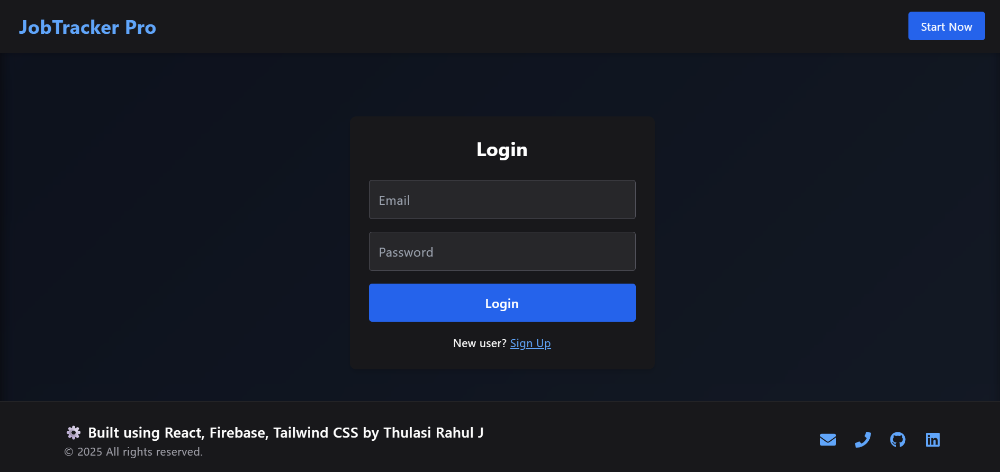
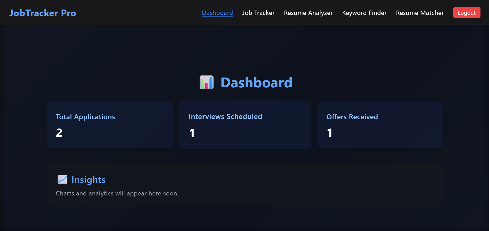
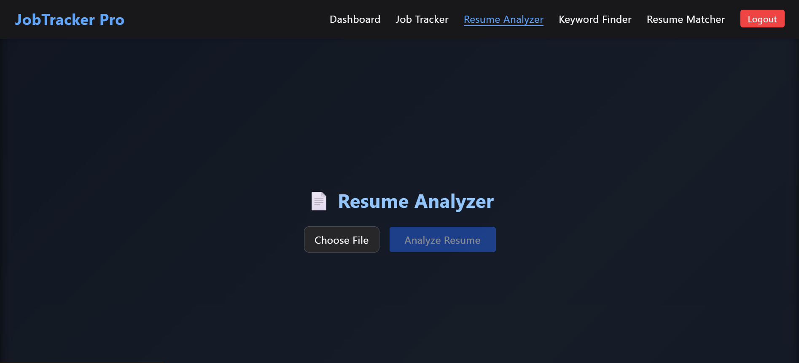
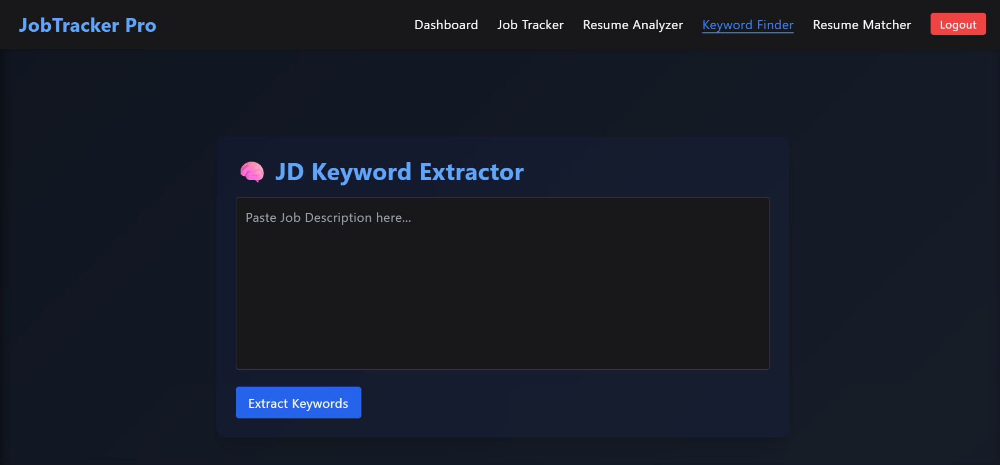

# 💼 JobTracker Pro

**AI-powered job tracking platform with resume analysis, JD matching, and smart insights. Built using React and Firebase.**

🟢 **Live Demo:** [https://jobtracker-pro-58e13.web.app/](https://jobtracker-pro-58e13.web.app/)

---

## 🚀 Features

- 🔐 **Authentication** – Sign up, log in, and manage access using Firebase Auth.
- 🏠 **Landing Page** – Modern home page with dark animated background and a call-to-action.
- 📊 **Dashboard** – Track total applications, interviews, and offers with live Firestore stats.
- 📝 **Job Tracker** – Add, edit, and manage job applications with status updates.
- 📄 **Resume Analyzer** – Upload a PDF resume and extract skills, projects, and contact details using PDF.js.
- 🧠 **JD Keyword Extractor** – Paste a job description and get the top keywords using custom logic.
- 📌 **Resume Matcher** – Coming soon: match resume content with job descriptions for optimization.
- 🌙 **Dark Theme** – All pages have a clean, modern dark UI with animations and hover effects.
- ⚙️ **User-specific Data** – All job/resume data is stored per user in Firestore for privacy and isolation.
- 📦 **Firebase Hosting** – Fully deployed and accessible from anywhere.

---

## 🔧 Tech Stack

- **Frontend:** React.js, Tailwind CSS, Framer Motion
- **Backend/Database:** Firebase Firestore
- **Auth:** Firebase Authentication
- **PDF Parsing:** pdfjs-dist
- **Hosting:** Firebase Hosting

---

## 📸 Screenshots

### 🔐 Authentication Page


### 📊 Dashboard


### 📄 Resume Analyzer


### 🧠 JD Keyword Extractor


---

## 📂 Folder Structure

```
/src
│
├── components/        # Navbar, Footer, Forms
├── pages/             # Dashboard, Tracker, Analyzer, Matcher
├── firebase.js        # Firebase config (now uses .env)
├── App.jsx            # Main app routing
└── index.html         # HTML entry point
```

---

## 🧪 Firebase Configuration

- Firestore with per-user access rules
- Authentication enabled (email/password)
- Hosting configured for SPA routing
- Environment variables stored in `.env`

---

## 🚀 Deployment Guide

```bash
# Install Firebase CLI globally
npm install -g firebase-tools

# Login to Firebase
firebase login

# Initialize Firebase in your project
firebase init

# Build your React app
npm run build

# Deploy to Firebase Hosting
firebase deploy
```

---

## 👨‍💻 Author

**Thulasi Rahul J**

- 🔗 [LinkedIn](https://www.linkedin.com/in/thulasirahulj/)  
- 💻 [GitHub](https://github.com/thulasirahul)

---
